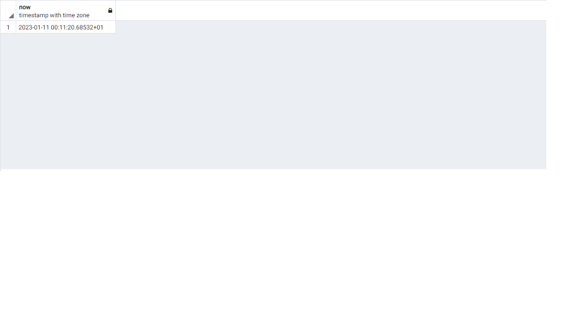
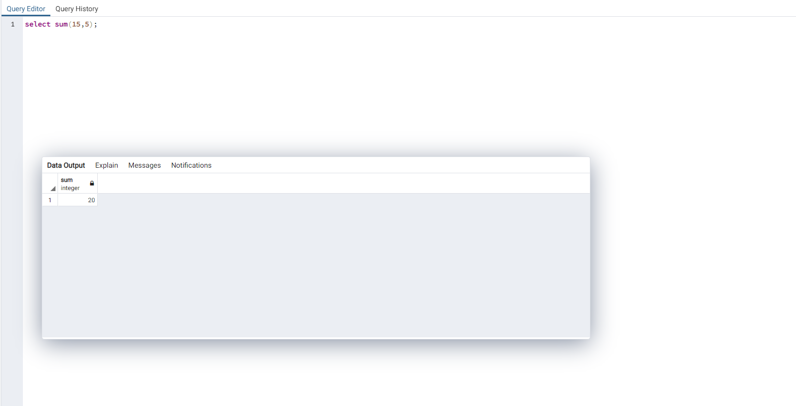
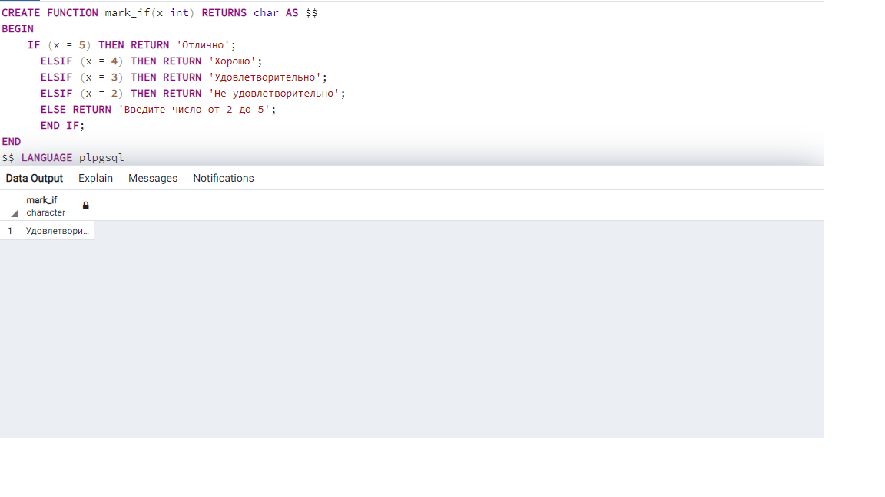
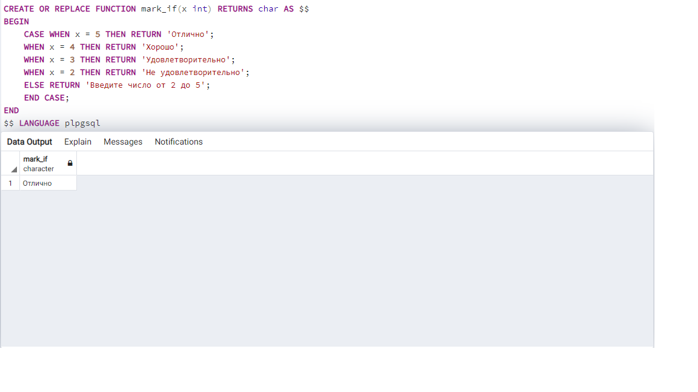
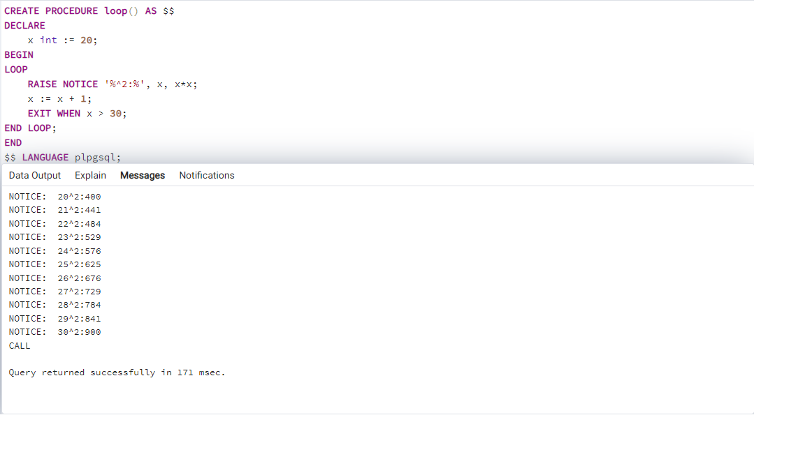
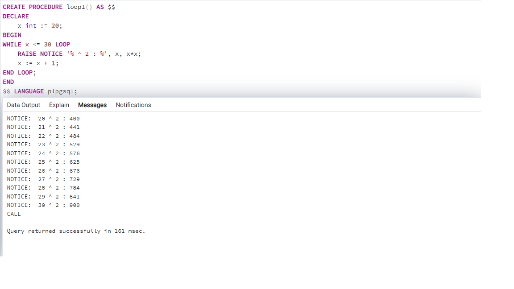
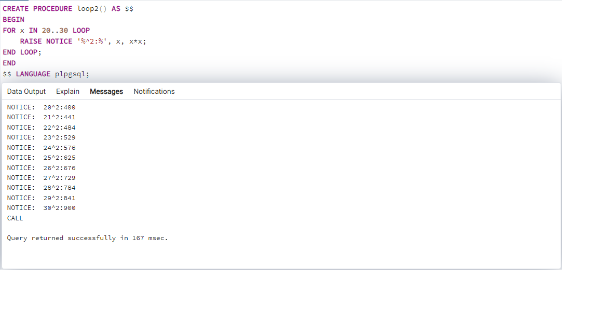
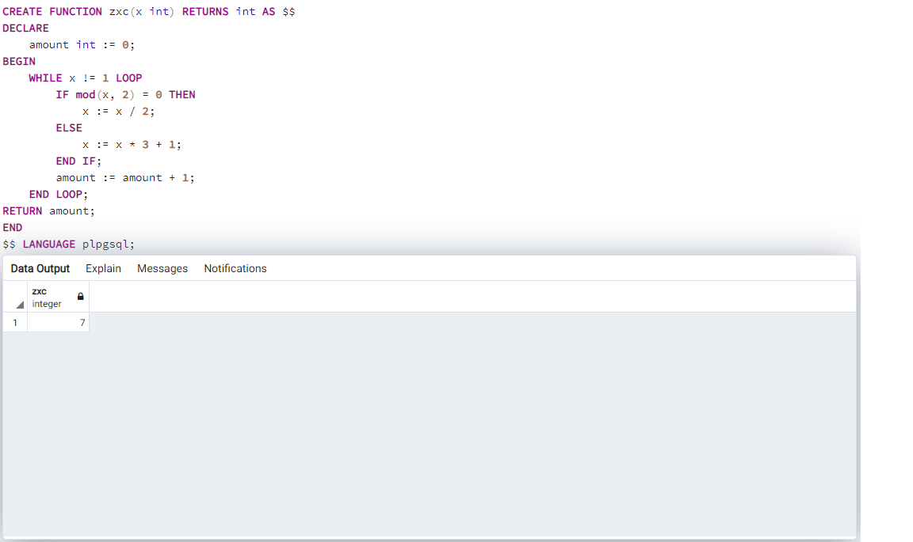
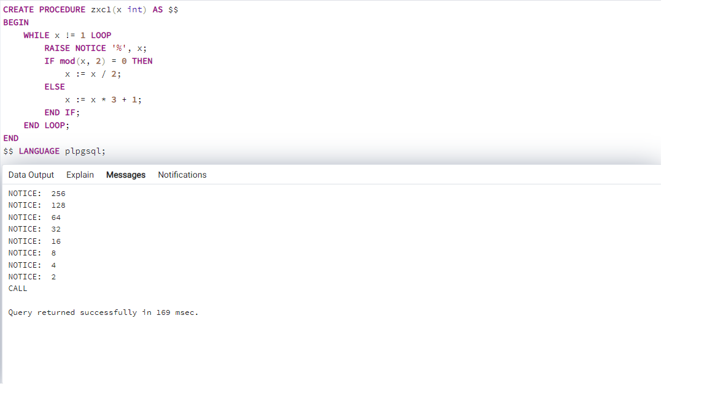

<h3> 1. Выведите на экран любое сообщение </h3>

```plpgsql
SELECT 'Privet'
```


<h3> 2. Выведите на экран текущую дату </h3>

```plpgsql
SELECT NOW()
```

Или

```plpgsql
SELECT CURRENT_TIME
```


<h3> 3. Создайте две числовые переменные и присвойте им значение. Выполните математические действия с этими числами и выведите результат на экран. </h3>

```plpgsql
CREATE FUNCTION zxc(x int, y int) RETURNS int AS $$
BEGIN
    RETURN x + y;
END
$$ LANGUAGE plpgsql
```
А затем мы выполняем запрос

~~~plpgsql
SELECT zxc(15,5);
~~~


<h3>4. Написать программу двумя способами 1 - использование IF, 2 - использование CASE. Объявите числовую переменную и присвоейте ей значение. Если число равно 5 - выведите на экран "Отлично". 4 - "Хорошо". 3 - Удовлетворительно". 2 - "Неуд". В остальных случаях выведите на экран сообщение, что введённая оценка не верна.</h3>  

Вариант решения через конструкцию if:
```plpgsql
CREATE FUNCTION mark_if(x int) RETURNS char AS $$
BEGIN
    IF (x = 5) THEN RETURN 'Отлично';
	  ELSIF (x = 4) THEN RETURN 'Хорошо';
	  ELSIF (x = 3) THEN RETURN 'Удовлетворительно';
	  ELSIF (x = 2) THEN RETURN 'Не удовлетворительно';
	  ELSE RETURN 'Введите число от 2 до 5';
	  END IF;
END
$$ LANGUAGE plpgsql
```


Вариант решения через конструкцию switch case:

```plpgsql
CREATE OR REPLACE FUNCTION mark_if(x int) RETURNS char AS $$
BEGIN
    CASE WHEN x = 5 THEN RETURN 'Отлично';
	WHEN x = 4 THEN RETURN 'Хорошо';
	WHEN x = 3 THEN RETURN 'Удовлетворительно';
	WHEN x = 2 THEN RETURN 'Не удовлетворительно';
	ELSE RETURN 'Введите число от 2 до 5';
	END CASE;
END
$$ LANGUAGE plpgsql
```


Вызов функции осуществялется при помощи следующего запроса

```plpgsql
SELECT mark_if(...);
```

<h3>5. Выведите все квадраты чисел от 20 до 30 3-мя разными способами (LOOP, WHILE, FOR).</h3>  

Вариант решения через конструкцию LOOP:

```plpgsql
CREATE PROCEDURE loop() AS $$
DECLARE
	x int := 20;
BEGIN
LOOP
	RAISE NOTICE '%^2:%', x, x*x;
	x := x + 1;
	EXIT WHEN x > 30;		
END LOOP;
END
$$ LANGUAGE plpgsql;
```



Вариант решения через конструкцию WHILE:

```plpgsql
CREATE PROCEDURE loop1() AS $$
DECLARE
	x int := 20;
BEGIN
WHILE x <= 30 LOOP
	RAISE NOTICE '% ^ 2 : %', x, x*x;
	x := x + 1;	
END LOOP;
END
$$ LANGUAGE plpgsql;
```


Вариант решения через конструкцию FOR:

```plpgsql
CREATE PROCEDURE loop2() AS $$
BEGIN
FOR x IN 20..30 LOOP
	RAISE NOTICE '%^2:%', x, x*x;	
END LOOP;
END
$$ LANGUAGE plpgsql;
```


Вызов процедуры отличается от функции и осуществялется при помощи следующего запроса

```plpgsql
CALL loop();
```


<h3>6. Последовательность Коллатца. Берётся любое натуральное число. Если чётное - делим его на 2, если нечётное, то умножаем его на 3 и прибавляем 1. Такие действия выполняются до тех пор, пока не будет получена единица. Гипотеза заключается в том, что какое бы начальное число n не было выбрано, всегда получится 1 на каком-то шаге. Задания: написать функцию, входной параметр - начальное число, на выходе - количество чисел, пока не получим 1; написать процедуру, которая выводит все числа последовательности. Входной параметр - начальное число.</h3>

Функция:  

```plpgsql
CREATE FUNCTION zxc(x int) RETURNS int AS $$
DECLARE
	amount int := 0;
BEGIN
	WHILE x != 1 LOOP
		IF mod(x, 2) = 0 THEN
			x := x / 2;
		ELSE
			x := x * 3 + 1;
		END IF;
		amount := amount + 1;
	END LOOP;
RETURN amount;
END
$$ LANGUAGE plpgsql;
```
Вызов функции производится при помощи запроса:
~~~plpgsql
SELECT zxc(3);
~~~



Процедура:  

```plphsql
CREATE PROCEDURE zxc1(x int) AS $$
BEGIN
	WHILE x != 1 LOOP
		RAISE NOTICE '%', x;
		IF mod(x, 2) = 0 THEN
			x := x / 2;
		ELSE
			x := x * 3 + 1;
		END IF;
	END LOOP;
END
$$ LANGUAGE plpgsql;
```
Вызов процедуры производится при помощи запроса:
~~~plpgsql
CALL zxc1(256);
~~~
