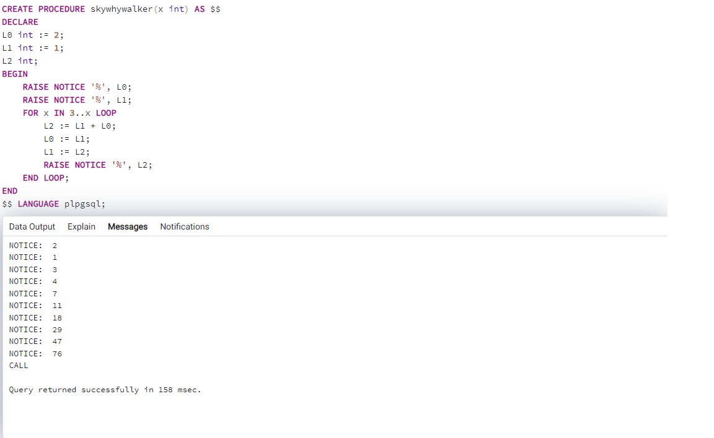

<h1>Барон Владислав Витальевич</h1>
<h2>Группа 3282</h2>

<h3>Запросы<h3>
<h4> 1. Выведите на экран любое сообщение </h4>

```plpgsql
SELECT 'Privet'
```


<h4> 2. Выведите на экран текущую дату </h4>

```plpgsql
SELECT NOW()
```

Или

```plpgsql
SELECT CURRENT_TIME
```


<h4> 3. Создайте две числовые переменные и присвойте им значение. Выполните математические действия с этими числами и выведите результат на экран. </h4>

```plpgsql
CREATE FUNCTION zxc(x int, y int) RETURNS int AS $$
BEGIN
    RETURN x + y;
END
$$ LANGUAGE plpgsql
```
А затем мы выполняем запрос

~~~plpgsql
SELECT zxc(15,5);
~~~


<h4>4. Написать программу двумя способами 1 - использование IF, 2 - использование CASE. Объявите числовую переменную и присвоейте ей значение. Если число равно 5 - выведите на экран "Отлично". 4 - "Хорошо". 3 - Удовлетворительно". 2 - "Неуд". В остальных случаях выведите на экран сообщение, что введённая оценка не верна.</h4>  

Вариант решения через конструкцию if:
```plpgsql
CREATE FUNCTION mark_if(x int) RETURNS char AS $$
BEGIN
    IF (x = 5) THEN RETURN 'Отлично';
	  ELSIF (x = 4) THEN RETURN 'Хорошо';
	  ELSIF (x = 3) THEN RETURN 'Удовлетворительно';
	  ELSIF (x = 2) THEN RETURN 'Не удовлетворительно';
	  ELSE RETURN 'Введите число от 2 до 5';
	  END IF;
END
$$ LANGUAGE plpgsql
```


Вариант решения через конструкцию switch case:

```plpgsql
CREATE OR REPLACE FUNCTION mark_if(x int) RETURNS char AS $$
BEGIN
    CASE WHEN x = 5 THEN RETURN 'Отлично';
	WHEN x = 4 THEN RETURN 'Хорошо';
	WHEN x = 3 THEN RETURN 'Удовлетворительно';
	WHEN x = 2 THEN RETURN 'Не удовлетворительно';
	ELSE RETURN 'Введите число от 2 до 5';
	END CASE;
END
$$ LANGUAGE plpgsql
```


Вызов функции осуществялется при помощи следующего запроса

```plpgsql
SELECT mark_if(...);
```

<h4>5. Выведите все квадраты чисел от 20 до 30 3-мя разными способами (LOOP, WHILE, FOR).</h4>  

Вариант решения через конструкцию LOOP:

```plpgsql
CREATE PROCEDURE loop() AS $$
DECLARE
	x int := 20;
BEGIN
LOOP
	RAISE NOTICE '%^2:%', x, x*x;
	x := x + 1;
	EXIT WHEN x > 30;		
END LOOP;
END
$$ LANGUAGE plpgsql;
```


Вариант решения через конструкцию WHILE:

```plpgsql
CREATE PROCEDURE loop1() AS $$
DECLARE
	x int := 20;
BEGIN
WHILE x <= 30 LOOP
	RAISE NOTICE '% ^ 2 : %', x, x*x;
	x := x + 1;	
END LOOP;
END
$$ LANGUAGE plpgsql;
```


Вариант решения через конструкцию FOR:

```plpgsql
CREATE PROCEDURE loop2() AS $$
BEGIN
FOR x IN 20..30 LOOP
	RAISE NOTICE '%^2:%', x, x*x;	
END LOOP;
END
$$ LANGUAGE plpgsql;
```


Вызов процедуры отличается от функции и осуществялется при помощи следующего запроса

```plpgsql
CALL loop();
```


<h4>6. Последовательность Коллатца. Берётся любое натуральное число. Если чётное - делим его на 2, если нечётное, то умножаем его на 3 и прибавляем 1. Такие действия выполняются до тех пор, пока не будет получена единица. Гипотеза заключается в том, что какое бы начальное число n не было выбрано, всегда получится 1 на каком-то шаге. Задания: написать функцию, входной параметр - начальное число, на выходе - количество чисел, пока не получим 1; написать процедуру, которая выводит все числа последовательности. Входной параметр - начальное число.</h4>

Функция:  

```plpgsql
CREATE FUNCTION zxc(x int) RETURNS int AS $$
DECLARE
	amount int := 0;
BEGIN
	WHILE x != 1 LOOP
		IF mod(x, 2) = 0 THEN
			x := x / 2;
		ELSE
			x := x * 3 + 1;
		END IF;
		amount := amount + 1;
	END LOOP;
RETURN amount;
END
$$ LANGUAGE plpgsql;
```
Вызов функции производится при помощи запроса:
~~~plpgsql
SELECT zxc(3);
~~~


Процедура:  

```plphsql
CREATE PROCEDURE zxc1(x int) AS $$
BEGIN
	WHILE x != 1 LOOP
		RAISE NOTICE '%', x;
		IF mod(x, 2) = 0 THEN
			x := x / 2;
		ELSE
			x := x * 3 + 1;
		END IF;
	END LOOP;
END
$$ LANGUAGE plpgsql;
```
Вызов процедуры производится при помощи запроса:
~~~plpgsql
CALL zxc1(256);
~~~


<h4>7. Числа Люка. Объявляем и присваиваем значение переменной - количество числе Люка. Вывести на экран последовательность чисел. Где L0 = 2, L1 = 1 ; Ln=Ln-1 + Ln-2 (сумма двух предыдущих чисел). Задания: написать фунцию, входной параметр - количество чисел, на выходе - последнее число (Например: входной 5, 2 1 3 4 7 - на выходе число 7); написать процедуру, которая выводит все числа последовательности. Входной параметр - количество чисел.</h4>

Функция:

```plpgsql
CREATE FUNCTION sky(x int) RETURNS int AS $$
DECLARE
L0 int := 2;
L1 int := 1;
L2 int;
BEGIN
	FOR x IN 3..x LOOP
		L2 := L1 + L0;
		L0 := L1;
		L1 := L2;
	END LOOP;
	RETURN L2;
END
$$ LANGUAGE plpgsql;
```
Вызов функции производится при помощи запроса:
~~~plpgsql
SELECT sky(10);
~~~


Процедура:

```plpgsql
CREATE PROCEDURE skywhywalker(x int) AS $$
DECLARE
L0 int := 2;
L1 int := 1;
L2 int;
BEGIN
	RAISE NOTICE '%', L0;
	RAISE NOTICE '%', L1;
	FOR x IN 3..x LOOP
		L2 := L1 + L0;
		L0 := L1;
		L1 := L2;
		RAISE NOTICE '%', L2;
	END LOOP;
END
$$ LANGUAGE plpgsql;
```
Вызов процедуры производится при помощи запроса:
~~~plpgsql
CALL skywhywhalker(10);
~~~


<h4>8. Напишите функцию, которая возвращает количество человек родившихся в заданном году.</h4>

```plpgsql
CREATE FUNCTION pbyr(yearr int) RETURNS int AS $$
DECLARE
	amount int;
BEGIN
	SELECT count(*) INTO amount
	FROM people
	WHERE EXTRACT(year FROM people.birth_date) = yearr;
	RETURN amount;
END
$$ LANGUAGE plpgsql;
```
Вызов функции производится при помощи запроса:
~~~plpgsql
SELECT pby(2003);
~~~


<h4>9. Напишите функцию, которая возвращает количество человек с заданным цветом глаз.</h4>

~~~plpgsql
CREATE FUNCTION pbe(c varchar) RETURNS int AS $$
DECLARE
	amount int;
BEGIN
	SELECT count(*) INTO amount
	FROM people
	WHERE people.eyes = c;
	RETURN amount;
END
$$ LANGUAGE plpgsql;
~~~

Вызов функции производится при помощи запроса:

~~~plpgsql
SELECT pbe('blue');
~~~


<h4>10. Напишите функцию, которая возвращает ID самого молодого человека в таблице.</h4>

```plpgsql
CREATE FUNCTION ypi() RETURNS int AS $$
DECLARE
	yp int;
BEGIN
	SELECT id INTO yp
	FROM people
	WHERE birth_date = (SELECT max(birth_date) FROM people);
	RETURN yp;
END
$$ LANGUAGE plpgsql;
```
Вызов функции производится при помощи запроса:

~~~plpgsql
SELECT ypi();
~~~


<h4>11. Напишите процедуру, которая возвращает людей с индексом массы тела больше заданного. ИМТ = масса в кг / (рост в м)^2.</h4>

```plpgsql
CREATE PROCEDURE pbi(imt int) AS $$
DECLARE
	p people%ROWTYPE;
BEGIN
	FOR p IN
		SELECT * FROM people
	LOOP
		IF p.weight / ((p.growth/100)^2 > imt THEN
			RAISE NOTICE 'name: %, surname: %', p.name, p.surname;
		END IF;
	END LOOP;
END
$$ LANGUAGE plpgsql
```
<h4>12. Измените схему БД так, чтобы в БД можно было хранить родственные связи между людьми. Код должен быть представлен в виде транзакции (Например (добавление атрибута): BEGIN; ALTER TABLE people ADD COLUMN leg_size REAL; COMMIT;). Дополните БД данными.</h4>  

Создаём таблицу :
~~~plpgsql
CREATE TABLE "links" (
	"id" integer primary key,
	"people_id" INTEGER NOT NULL,
	"people_id_2" INTEGER NOT NULL, 
	"link" VARCHAR,
	FOREIGN KEY ("people_id") REFERENCES "people" ("id") ON UPDATE NO ACTION ON DELETE NO ACTION,
	FOREIGN KEY ("people_id_2") REFERENCES "people" ("id") ON UPDATE NO ACTION ON DELETE NO ACTION
	);
~~~

Добавляем данные при помощи транзакции : 

```plpgsql
BEGIN;
	INSERT INTO links (id, people_id, people_id_2, link)
	VALUES  (1, 2, 6, 'брат'),
			(2, 4, 5, 'сестра');
COMMIT;
```


<h4>13. Напишите процедуру, которая позволяет создать в БД нового человека с указанным родством.</h4>

```plpgsql
CREATE PROCEDURE ap(id_people int, name_people varchar, id_people_2 int, name_people_2 varchar, name_link varchar)
AS $$
DECLARE
BEGIN
INSERT INTO people (id, name)
VALUES (id_people, name_people);
IF NOT EXISTS (SELECT * FROM people WHERE id = id_people_2) THEN
INSERT INTO people (id, name)
VALUES (id_people_2, name_people_2);
END IF;
INSERT INTO links (people_id, people_id_2, link)
VALUES (id_people, id_people_2, name_link); 
END;
$$ LANGUAGE plpgsql;
```

Вызов процедуры производится при помощи запроса:

```plpgsql
CALL apbl(9, 'Kirill', 7, 'Sergey', 'брат')
```

<h4>14. Измените схему БД так, чтобы в БД можно было хранить время актуальности данных человека (выполнить также, как п.12).</h4>
  
Для этого создаём дополнительный столбец :

```plpgsql
ALTER TABLE people ADD COLUMN update_date date default now()
```


<h4>15. Напишите процедуру, которая позволяет актуализировать рост и вес человека.</h4>

```plpgsql
CREATE PROCEDURE update_evr(id_p int, new_growth numeric, new_weight numeric) AS $$
BEGIN
	UPDATE people SET growth = new_growth WHERE id = id_p;
	UPDATE people SET weight = new_weight WHERE id = id_p;
	UPDATE people SET update_date = now() WHERE id = id_p;
END;
$$ LANGUAGE plpgsql
```

Вызов процедуры производится при помощи запроса:

```plpgsql
call update_evr(8, 175.2, 55.9);
```